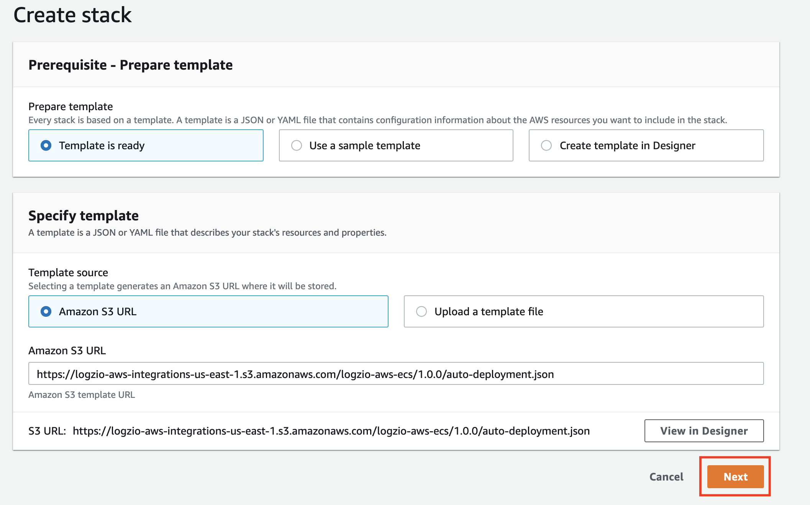
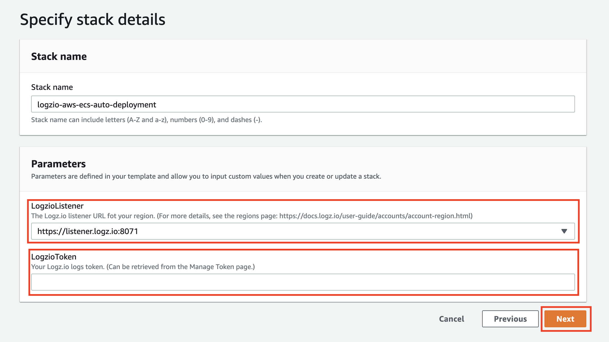

# Logz.io AWS ECS Collector

This integration uses Fluentd in a Docker container to forward logs from your Amazon Elastic Container Service (ECS) cluster to Logz.io.

**Note** that this repo refers to an EC2-based cluster. For Fargate-based cluster see [this](https://docs.logz.io/shipping/log-sources/fargate.html).

You can deploy this integration in two ways:
* [Manual deployment (Classic Console)](https://github.com/logzio/logzio-aws-ecs/tree/refactoring#manual-deployment).
* [Cloudformation deployment](https://github.com/logzio/logzio-aws-ecs/tree/refactoring#cloudformation-deployment).

## Manual deployment

### 1. Download the task definition JSON

Download the task definition JSON file:

```shell
wget https://raw.githubusercontent.com/logzio/logzio-aws-ecs/master/task-definition.json
```

### 2. Configure the task

In your prefered text editor, open the JSON you downloaded in the previous step and replace the following:

| Paramater | Details |
|---|---|
| `<<LOG-SHIPPING-TOKEN>>` | **Required**. Your Logz.io account token. Replace with the [token](https://app.logz.io/#/dashboard/settings/general) of the account you want to ship to. |
| `<<LISTENER-HOST>>` | **Required**. Your Logz.io listener URL. Replace with your region's listener URL.|


### 3. Advanced settings (optional)

Since the Docker image is based on Logz.io's [fluentd-docker-logs](https://github.com/logzio/fluentd-docker-logs) image, any of the environment variables mentioned [here](https://github.com/logzio/fluentd-docker-logs#parameters) can be added to the task definition JSON.


### 4. Add your task definition

1. In your [Amazon ECS Classic Console](https://console.aws.amazon.com/ecs/) menu go to **Task Definitions** and click on **Create new Task Definition**.

2. In the **Step 1: Select launch type compatibility** screen choose **EC2** and click **Next step**.

3. In the **Step 2: Configure task and container definitions** screen, scroll down and click on the **Configure via JSON** button.

4. In the text-box, delete the existing text and paste your configured task definition JSON. Press **Save**, then press **Create**.

### 5. Run the task

1. After the task was created, click on the **Actions** button, then choose **Run Task**.

2. In the **Run Task** screen, choose **EC2** as your **Launch type**.

3. Choose the cluster you want to ship logs from.

4. For **Placement Templates**, choose **One Task Per Host**.

5. Click on **Run Task**.

### 6. Check Logz.io for your logs

Give your logs some time to get from your system to ours, and then open [Kibana](https://app.logz.io/#/dashboard/kibana).


## Cloudformation deployment

### 1. Configure and create your stack

Click the button that matches your AWS region, then follow the instructions below:

| AWS Region | Launch button |
| --- | --- |
| `us-east-1` | [](https://console.aws.amazon.com/cloudformation/home?region=us-east-1#/stacks/create/template?templateURL=https://logzio-aws-integrations-us-east-1.s3.amazonaws.com/logzio-aws-ecs/1.0.0/auto-deployment.json&stackName=logzio-aws-ecs-auto-deployment) |

**Note:** if your region is not in the list, let us know in the [repo's issues](https://github.com/logzio/logzio-aws-ecs/issues), or reach out to Logz.io's support team!

#### In screen **Step 1 Specify template**:

Keep the defaults and click **Next**.



#### In screen **Step 2 Specify stack details**:

1. For **Stack name** you can keep the default, or change the stack name.

2. For **LogzioListener** - choose your Logz.io listener from the list.

3. For **LogzioToken** - insert your Logz.io logs shipping token.

4. Click **Next**.



#### In screen **Step 3 Configure stack options** (Optional):

If you want to, you can add your custom tags, or not. Click on **Next**.

#### In screen **Step 4 Review**:

Scroll down and click on **Create stack**.

### 2. Give your stack a few moments to launch.

### 3. Run the task

1. Go to your AWS ECS page, and on the left menu, click on **Task Definitions**, then choose the task you just created.

2. Click on the **Actions** button, then choose **Run Task**.

3. In the **Run Task** screen, choose **EC2** as your **Launch type**.

4. Choose the cluster you want to ship logs from.

5. For **Placement Templates** choose **One Task Per Host**.

6. Click on **Run Task**.

### 6. Check Logz.io for your logs

Give your logs some time to get from your system to ours, and then open [Kibana](https://app.logz.io/#/dashboard/kibana).

## Changelog

See this project's [changelog](https://github.com/logzio/logzio-aws-ecs/blob/master/CHANGELOG.md).
